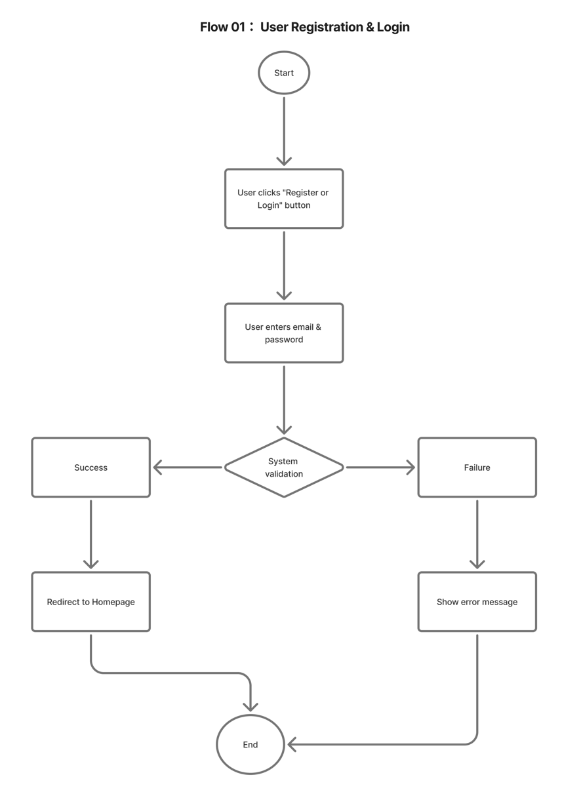
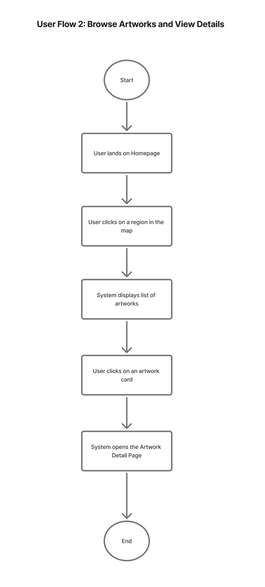
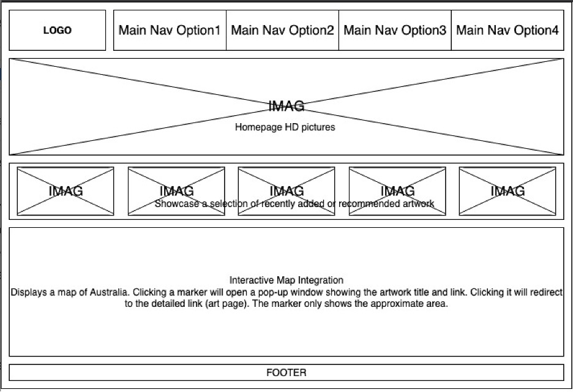
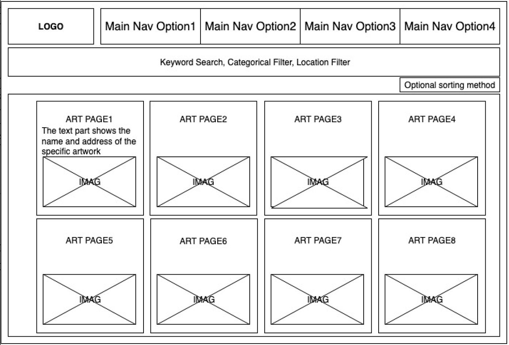
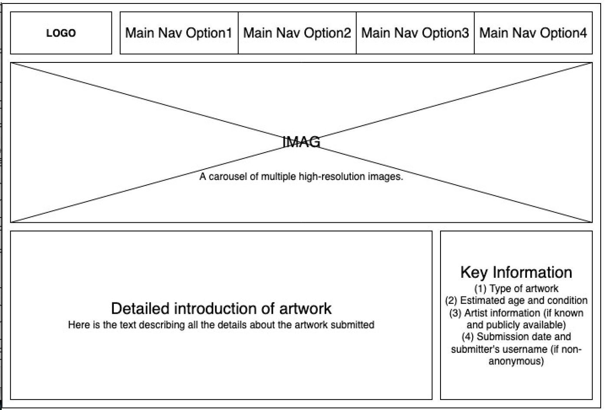
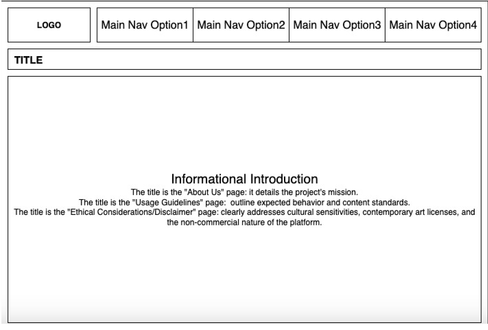

### User Flows

## User Flow 1: User Registration & Login

**Purpose:**  
Allow new or returning users to securely access their account in order to use personalized features of the platform.

**Steps:**

1. **Start**
2. User clicks **"Register / Login"** button
3. User enters **email & password**
4. System validation
   - **Success** → Redirect to Homepage
   - **Failure** → Show error message
5. **End**

**Flow Diagram:**  

---

## User Flow 2: Browse Artworks & View Details

**Purpose:**  
Enable users to explore Indigenous artworks by location and view detailed information.

**Steps:**

1. **Start**
2. User lands on **Homepage**
3. User clicks a **region on the map**
4. System displays **list of artworks**
5. User clicks an **artwork card**
6. System shows the **Artwork Detail Page**
7. **End**

**Flow Diagram:**  

---

## Wireframs

### Homepage

| Footnote | Label                    | Description                                            | Control Type         | Content Type    | Possible Value                         | Business rules                                                  |
| -------- | ------------------------ | ------------------------------------------------------ | -------------------- | --------------- | -------------------------------------- | --------------------------------------------------------------- |
| 1        | Logo                     | Click to return to the top of the homepage             | Button (Navigation)  | Image           | Off; Hover; On                         | Unified placement of the entire site                            |
| 2        | Nav 1 – Map              | Jumps and scrolls to the “Map” section on homepage     | Anchor Navigation    | Text            | Off; Hover; On; Focus                  | In-page scroll to map anchor                                    |
| 3        | Nav 2 – Artworks         | Opens the Artworks search/list page                    | Button (Navigation)  | Text            | Off; Hover; On                         |                                                                 |
| 4        | Nav 3 – About Us         | Opens the “About Us” info page                         | Button (Navigation)  | Text            | Off; Hover; On                         |                                                                 |
| 5        | Nav 4 – Register         | Opens the registration page (primarily for artists)    | Button (Navigation)  | Text            | Off; Hover; On                         |                                                                 |
| 6        | Hero – HD Image          | Large hero image at the top of the homepage            | Image (Display)      | Image           | Default; Loading; Error                |                                                                 |
| 7        | Featured/Recent Artworks | Shows a row of latest/featured artwork cards           | Card (Navigation)    | Image + Text    | Off; Hover; On; Loading                | Default 4 items; show empty state when no data                  |
| 8        | Map Container            | Australia map with approximate artwork locations       | Map (Interactive)    | Tiles + Markers | Loading; Idle; Panning; Zooming; Error | Sensitive locations show only general area; no exact coordinate |
| 9        | Map Marker Popup         | Shows artwork title + brief info; click to open detail | Popover (Navigation) | Text + Link     | Off; Hover; On                         |                                                                 |
| 9        | Footer – About Us        | Opens “About Us”                                       | Link (Navigation)    | Text            | Off; Hover; On                         |                                                                 |
| 10       | Footer – Usage Guideline | Opens “Usage Guideline”                                | Link (Navigation)    | Text            | Off; Hover; On                         |                                                                 |
| 11       | Footer – Disclaimer      | Opens “Ethical Considerations / Disclaimer”            | Link (Navigation)    | Text            | Off; Hover; On                         |                                                                 |

### Search/List

| Footnote | Label                   | Description                                 | Control Type      | Content Type | Possible Value                 | Business rules                              |
| -------- | ----------------------- | ------------------------------------------- | ----------------- | ------------ | ------------------------------ | ------------------------------------------- |
| 1        | Keyword Search          | Search by title/artist/description keywords | Input (Search)    | Text         | Focus; Typing; Clear; Error    | Unified placement of the entire site        |
| 2        | Category Filter         | Filter by Art Type and Period               | Anchor Navigation | Text         | Selected; Disabled             | In-page scroll to map anchor                |
| 3        | Location Filter         | Filter by state/territory (broad regions)   | Select (Filter)   | Text         | Selected; Disabled             |                                             |
| 4        | Optional Sorting Method | Sort by date ascending/descending           | Select (Sort)     | Text         | Default; Asc; Desc             |                                             |
| 5        | Art Page                | Show the artwork’s title, address and image | Card (Navigation) | Text + Image | Off; Hover; On; Loading; Empty | Grid layout; click card to open detail page |

### Art Pages

| Footnote | Label                            | Description                                               | Control Type | Content Type | Possible Value                        | Business rules                                              |
| -------- | -------------------------------- | --------------------------------------------------------- | ------------ | ------------ | ------------------------------------- | ----------------------------------------------------------- |
| 1        | HD Image Carousel                | Search by title/artist/description keywords               | Carousel     | Images       | Default; Prev/Next; Fullscreen; Error |                                                             |
| 2        | Detailed Introduction of artwork | Full textual description of the artwork                   | Text Block   | Text         | Default                               |                                                             |
| 3        | Key Information                  | Show type, estimated period, condition, artist info, etc. | List + Link  | Text         | Default; Missing                      | If having artist, click artist name to “artist information” |

### Info Pages

| Footnote | Label                      | Description                                                 | Control Type   | Content Type | Possible Value | Business rules |
| -------- | -------------------------- | ----------------------------------------------------------- | -------------- | ------------ | -------------- | -------------- |
| 1        | Title                      | Page title (About / Usage Guideline / Ethical & Disclaimer) | Text (Heading) | Text         | Default        |                |
| 2        | Informational Introduction | Main body text for the info page                            | Text Block     | Text         | Default        |                |
