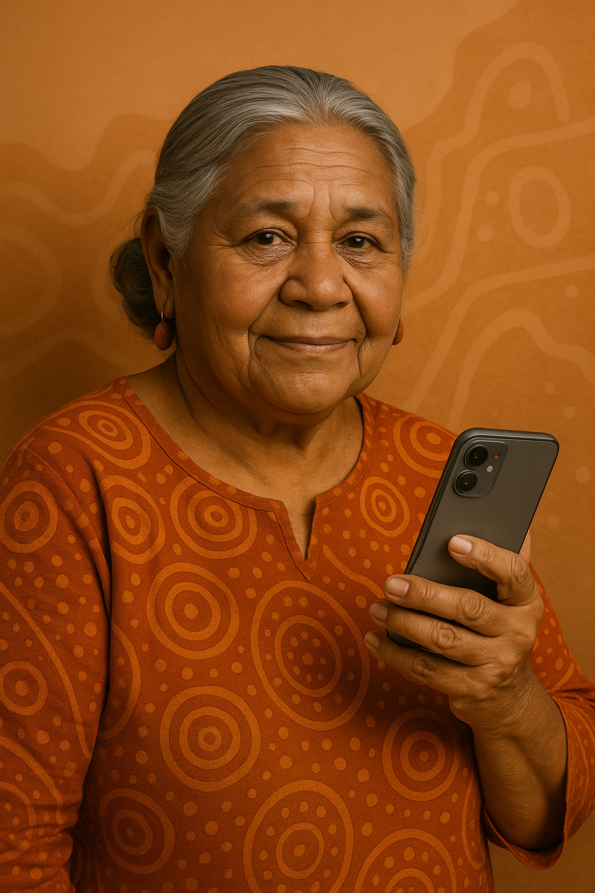
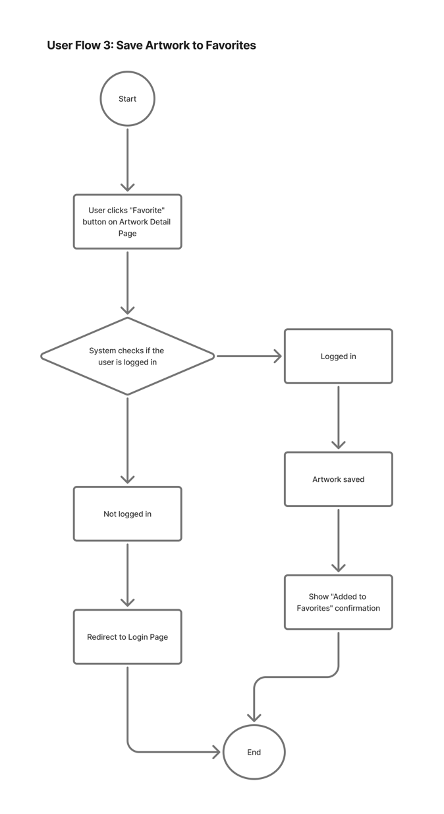

# Indigenous Art Atlas — User Personas

> Community-driven database for tracking and sharing Indigenous art across cave art, contemporary gallery pieces, and public installations. This document captures two primary personas to guide UX and development decisions.

---

## Persona 1 — Aunty Margaret Wirrinyga

> **“Our art carries our stories.”**

### Snapshot
| Field | Detail |
|---|---|
| Role | Community Elder; cultural custodian |
| Gender | Female |
| Age | 58 |
| Education | High School; lifelong cultural learning via Elders |
| Location | Regional Northern Territory |
| Family | Children and grandchildren; active in oral storytelling |
| Transport | Toyota LandCruiser (community trips) |
| Favorite Drink | Bush tea |
| Hobbies | Painting with ochre; bush cooking |

### Hardware & Software
- Phone: **Samsung A52 (Android)**
- Laptop: Uses daughter’s **Windows 10** laptop occasionally
- Digital literacy: **Limited** — prefers simple UIs, large buttons, and audio support

### “Grab‑ability” Items
- Woven basket she made as a girl  
- Community radio, daily listener  
- Loves bush tucker cooking  
- Paints with ochre and natural pigments  

### Goals & Needs
- **Share and protect cultural art** for younger generations
- **Simple, low-friction uploads** (photo + audio narration)
- **Granular access controls** (e.g., “Community Only”, time-limited or location‑sensitive content)
- **Cultural protocol prompts** and consent reminders during upload

### Behaviors
- Travels to remote art sites with nieces/nephews
- Captures photos and **voice stories** on phone; needs easy batch upload
- Prefers **guided workflows** over complex navigation

### Pain Points & Risks
- Fear of **misuse of sacred knowledge** or site locations
- **Complex navigation** and **inappropriate tags**
- Low connectivity in remote areas; needs **offline‑first capture** with later sync

### Values & Personality
- **Observant, patient, protective** of community knowledge  
- Values **respect, community input, cultural sensitivity**  
- **Pet peeve:** Outsiders misrepresenting Indigenous art without consent

### Story (Context of Use)
Aunty Margaret documents weathering cave paintings and narrates oral histories. She will upload photos with **audio stories** and apply **“Community Only”** visibility. The Atlas should **teach, protect, and respect**—not merely archive.

### Design Implications
- Upload wizard with **audio narration** support and **protocol checklists**
- **Role‑based access** and **content visibility** controls (Public / Community / Private)
- **Consent & attribution** fields, plus **warning banners** for sensitive content
- **Offline capture → queued sync** for low‑connectivity workflows
- **Large, high‑contrast UI**, clear iconography, multilingual support

---

## Persona 2 — Jack Thompson

> **“I want to learn respectfully and contribute meaningfully.”**

### Snapshot
| Field | Detail |
|---|---|
| Role | Academic researcher; gallery collaborator |
| Gender | Male |
| Age | 29 |
| Education | Master’s in Museum & Heritage Studies |
| Location | Melbourne |
| Household | Lives with partner |
| Transport | Subaru Outback |
| Favorite Drink | Flat White |
| Hobbies | Photography, sketching, travel exhibitions |

### Hardware & Software
- Phone: **iPhone 14 Pro**
- Laptop: **MacBook Pro (2022)**
- Tools: Academic databases, **digital mapping** / GIS tools
- Digital literacy: **High**, confident with data and metadata standards

### Goals & Needs
- **Advanced search & filters** (location, artist, medium, time period, permissions)
- **Metadata‑rich records**, citations, and export for academic use
- Clear **permissions/ownership** badges; respect for **restricted entries**
- **Community collaboration** features (contact artists, request access)

### Behaviors
- Prepares exhibition proposals; researches **public murals** and installations
- Downloads **high‑quality images** and metadata **where permitted**
- Avoids restricted content; seeks **transparent access rationale**

### Pain Points & Risks
- Dislikes “**tokenistic**” exhibitions or research without Indigenous voices
- Needs **trusted provenance**, **clear consent**, and **proper attribution**
- Risk of **over‑exposure** of locations if permissions are unclear

### Values & Personality
- **Curious, analytical, culturally sensitive**
- Values **collaboration, transparency, cultural consent**
- **Pet peeve:** Research or curation that **overlooks Indigenous voices**

### Story (Context of Use)
Jack searches urban Indigenous murals by **location and artist**, exports permitted images with metadata, and sees **clear notices on restricted records**. Transparency and community control reinforce trust and ethical use.

### Design Implications
- **Faceted search** (permissions, custodians, location radius, media type)
- **Provenance & licensing** panels with **community ownership** and contact info
- **Cite‑this‑record** helpers (BibTeX/APA/Harvard), **export JSON/CSV**
- **Request‑access** workflow routed to custodians; activity logs for accountability

---

## Cross‑Persona Requirements

1. **Cultural Protocols by Design**  
   - Consent prompts, ownership fields, and visibility defaults
   - Sensitive‑content banners; **watermarking / blur** options for sacred material

2. **Access & Governance**  
   - Roles: Elder / Artist / Researcher / Public  
   - **Content visibility tiers** and **audit trails**

3. **Connectivity & Performance**  
   - Offline capture, queueing, and conflict resolution  
   - Image compression, resumable uploads

4. **Safety & Integrity**  
   - Location fuzzing (for sacred sites)  
   - Copyright, attribution, and takedown process

5. **Usability**  
   - Plain‑language UI, assistive text, and audio prompts  
   - Clear empty‑state examples and step‑by‑step upload flows

### User Flows

## User Flow 1: User Registration & Login

**Purpose:**  
Allow new or returning users to securely access their account in order to use personalized features of the platform.

**Steps:**

1. **Start**
2. User clicks **"Register / Login"** button
3. User enters **email & password**
4. System validation
   - **Success** → Redirect to Homepage
   - **Failure** → Show error message
5. **End**

**Flow Diagram:**  

---

## User Flow 2: Browse Artworks & View Details

**Purpose:**  
Enable users to explore Indigenous artworks by location and view detailed information.

**Steps:**

1. **Start**
2. User lands on **Homepage**
3. User clicks a **region on the map**
4. System displays **list of artworks**
5. User clicks an **artwork card**
6. System shows the **Artwork Detail Page**
7. **End**

**Flow Diagram:**  

---
### User Flow 3: Save Artwork to Favorites

**Purpose:**  
Allow users to save artworks to their personal Favorites list for later access.

**Steps:**

1. **Start**
2. User clicks **"Favorite" button** on the Artwork Detail Page
3. System checks if user is logged in
   - **Yes** → Artwork saved → Show confirmation "Added to Favorites"
   - **No** → Redirect to **Login Page**
4. **End**

**Flow Diagram:**  

---

## Wireframs

### Homepage

| Footnote | Label                    | Description                                            | Control Type         | Content Type    | Possible Value                         | Business rules                                                  |
| -------- | ------------------------ | ------------------------------------------------------ | -------------------- | --------------- | -------------------------------------- | --------------------------------------------------------------- |
| 1        | Logo                     | Click to return to the top of the homepage             | Button (Navigation)  | Image           | Off; Hover; On                         | Unified placement of the entire site                            |
| 2        | Nav 1 – Map              | Jumps and scrolls to the “Map” section on homepage     | Anchor Navigation    | Text            | Off; Hover; On; Focus                  | In-page scroll to map anchor                                    |
| 3        | Nav 2 – Artworks         | Opens the Artworks search/list page                    | Button (Navigation)  | Text            | Off; Hover; On                         |                                                                 |
| 4        | Nav 3 – About Us         | Opens the “About Us” info page                         | Button (Navigation)  | Text            | Off; Hover; On                         |                                                                 |
| 5        | Nav 4 – Register         | Opens the registration page (primarily for artists)    | Button (Navigation)  | Text            | Off; Hover; On                         |                                                                 |
| 6        | Hero – HD Image          | Large hero image at the top of the homepage            | Image (Display)      | Image           | Default; Loading; Error                |                                                                 |
| 7        | Featured/Recent Artworks | Shows a row of latest/featured artwork cards           | Card (Navigation)    | Image + Text    | Off; Hover; On; Loading                | Default 4 items; show empty state when no data                  |
| 8        | Map Container            | Australia map with approximate artwork locations       | Map (Interactive)    | Tiles + Markers | Loading; Idle; Panning; Zooming; Error | Sensitive locations show only general area; no exact coordinate |
| 9        | Map Marker Popup         | Shows artwork title + brief info; click to open detail | Popover (Navigation) | Text + Link     | Off; Hover; On                         |                                                                 |
| 9        | Footer – About Us        | Opens “About Us”                                       | Link (Navigation)    | Text            | Off; Hover; On                         |                                                                 |
| 10       | Footer – Usage Guideline | Opens “Usage Guideline”                                | Link (Navigation)    | Text            | Off; Hover; On                         |                                                                 |
| 11       | Footer – Disclaimer      | Opens “Ethical Considerations / Disclaimer”            | Link (Navigation)    | Text            | Off; Hover; On                         |                                                                 |

### Search/List

| Footnote | Label                   | Description                                 | Control Type      | Content Type | Possible Value                 | Business rules                              |
| -------- | ----------------------- | ------------------------------------------- | ----------------- | ------------ | ------------------------------ | ------------------------------------------- |
| 1        | Keyword Search          | Search by title/artist/description keywords | Input (Search)    | Text         | Focus; Typing; Clear; Error    | Unified placement of the entire site        |
| 2        | Category Filter         | Filter by Art Type and Period               | Anchor Navigation | Text         | Selected; Disabled             | In-page scroll to map anchor                |
| 3        | Location Filter         | Filter by state/territory (broad regions)   | Select (Filter)   | Text         | Selected; Disabled             |                                             |
| 4        | Optional Sorting Method | Sort by date ascending/descending           | Select (Sort)     | Text         | Default; Asc; Desc             |                                             |
| 5        | Art Page                | Show the artwork’s title, address and image | Card (Navigation) | Text + Image | Off; Hover; On; Loading; Empty | Grid layout; click card to open detail page |

### Art Pages

| Footnote | Label                            | Description                                               | Control Type | Content Type | Possible Value                        | Business rules                                              |
| -------- | -------------------------------- | --------------------------------------------------------- | ------------ | ------------ | ------------------------------------- | ----------------------------------------------------------- |
| 1        | HD Image Carousel                | Search by title/artist/description keywords               | Carousel     | Images       | Default; Prev/Next; Fullscreen; Error |                                                             |
| 2        | Detailed Introduction of artwork | Full textual description of the artwork                   | Text Block   | Text         | Default                               |                                                             |
| 3        | Key Information                  | Show type, estimated period, condition, artist info, etc. | List + Link  | Text         | Default; Missing                      | If having artist, click artist name to “artist information” |

### Info Pages

| Footnote | Label                      | Description                                                 | Control Type   | Content Type | Possible Value | Business rules |
| -------- | -------------------------- | ----------------------------------------------------------- | -------------- | ------------ | -------------- | -------------- |
| 1        | Title                      | Page title (About / Usage Guideline / Ethical & Disclaimer) | Text (Heading) | Text         | Default        |                |
| 2        | Informational Introduction | Main body text for the info page                            | Text Block     | Text         | Default        |                |

### Registered User Features

| Footnote | Label            | Description                             | Control Type       | Content Type      | Possible Values                                  | Business Rules                                  | Link Destination          |
| -------- | ---------------- | --------------------------------------- | ----------------- | ---------------- | ----------------------------------------------- | ----------------------------------------------- | ------------------------ |
| 1        | Username         | User login name                          | Text Input        | String           | 3–20 characters, alphanumeric                  | Required, must be unique                         | N/A                      |
| 2        | Password         | User login password                      | Password Input    | String           | Minimum 8 characters                            | Required, hashed before storage                 | N/A                      |
| 3        | User Role        | User type selection                      | Dropdown / Radio  | Enum             | General Public, Artist                          | Required                                        | N/A                      |
| 4        | Art Title        | Title of the art piece                   | Text Input        | String           | Any text, max 255 characters                   | Required                                        | N/A                      |
| 5        | Art Description  | Detailed description of the art          | Textarea          | String           | Any text                                       | Required                                        | N/A                      |
| 6        | Art Type         | Category of the art                      | Dropdown          | Enum             | Painting, Sculpture, Digital, Other           | Required                                        | N/A                      |
| 7        | Location Pin     | Geographical location                    | Map Picker        | Latitude/Longitude | N/A                                           | Required                                        | N/A                      |
| 8        | Image Upload     | Upload images of the art                 | File Upload       | JPEG/PNG         | Multiple allowed, max 5MB per file            | Required, stored on server, path saved in DB    | Stored on server, DB path |
| 9        | My Submissions   | User dashboard of submitted art          | Table / Dashboard | List of submissions | Status: Pending, Approved, Rejected           | Users can edit/delete their own submissions    | Submission edit page      |
| 10       | Report Content   | Report inappropriate or inaccurate content | Button / Form   | String (reason)  | Inappropriate, Inaccurate, Other              | Only for logged-in users                        | Admin report page         |

### Administrator Features

| Footnote | Label                     | Description                           | Control Type      | Content Type      | Possible Values                                               | Business Rules                                                     | Link Destination            |
| -------- | ------------------------- | ------------------------------------- | ---------------- | ---------------- | ------------------------------------------------------------- | ----------------------------------------------------------------- | -------------------------- |
| 1        | Admin Username            | Admin login name                       | Text Input        | String           | 3–20 characters, alphanumeric                                 | Required, must be admin account                                     | N/A                        |
| 2        | Admin Password            | Admin login password                   | Password Input    | String           | Minimum 8 characters                                           | Required, hashed before storage                                     | N/A                        |
| 3        | Dashboard                 | Overview of key statistics             | Panel / Table     | Stats            | N/A                                                            | Display number of pending submissions, total users                 | Admin Dashboard Page        |
| 4        | Art Submission Moderation | Review submitted artworks              | Table / Form      | List of submissions | Status: Pending, Approved, Rejected                          | Can Approve, Reject (with reason), Edit, Delete; override location_sensitive_flag | Art Submission Page         |
| 5        | User Management           | Manage registered users                | Table / Form      | List of users    | Roles: General Public, Artist; Status: Active, Deactivated    | Can change roles, activate/deactivate, delete users                | User Management Page        |
| 6        | Category / Tag Management | Manage art types and periods           | Form / Table      | Enum             | Art Types: Painting, Sculpture…; Periods: Renaissance, Modern… | Can Add/Edit/Delete categories and periods                          | Category/Tag Management Page|
| 7        | Reports (Optional)        | Manage reported content                | Table / Form      | List of reports  | Reason: Inappropriate, Inaccurate, Other                      | Only accessible to admins                                          | Reports Page               |
