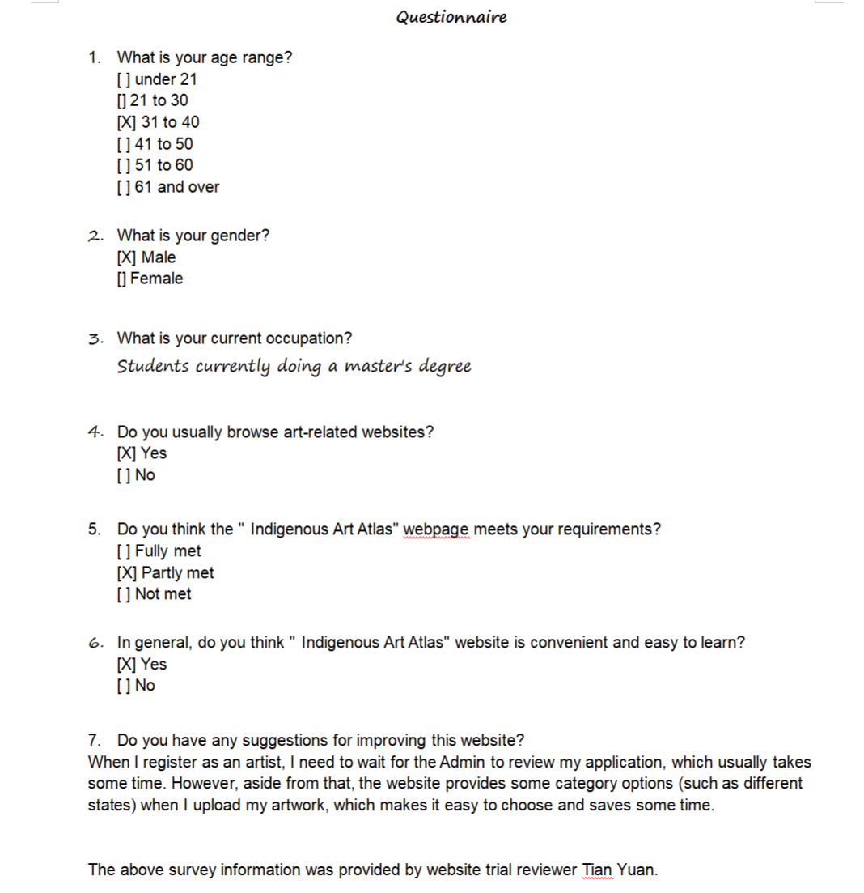
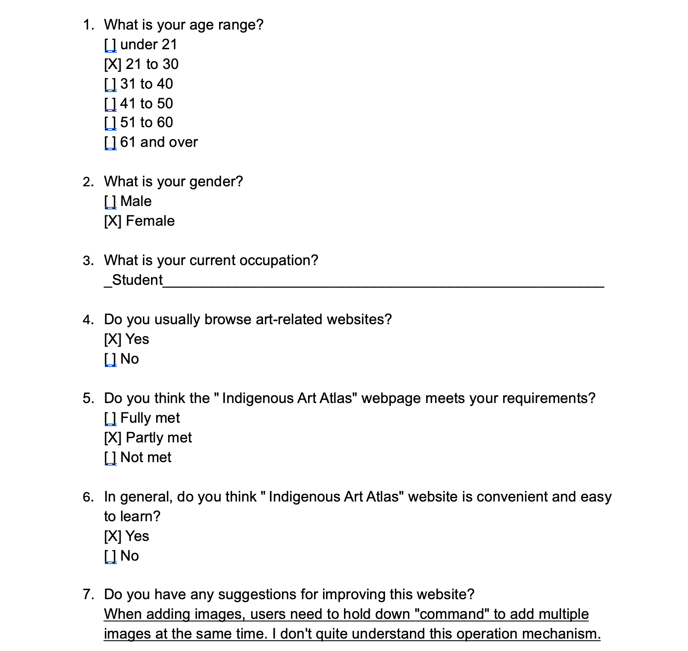
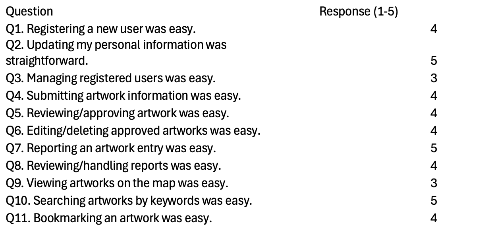
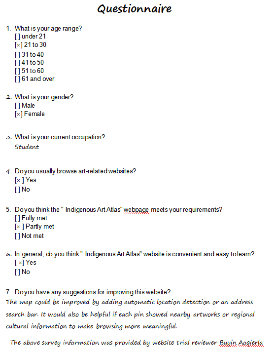

# COMP9030 Cycle 4 Usability Test

## Introduction
The **Indigenous Art Atlas (IAA)** is a purpose-built web platform designed to document, visualise, and disseminate information about Indigenous artworks — including traditional, contemporary and culturally significant installations — within their geographical and cultural contexts.

From a developer’s perspective, the core objectives were:

1. Provide a robust, user‑centric interactive experience  
2. Support accurate and respectful cultural representation  
3. Facilitate sustainable, non‑commercial educational access  

---

## Functional Overview

### Interactive Map View
- Spatial map interface displaying artwork markers
- Clicking markers reveals artwork metadata, cultural provenance & historical significance  
- Emphasises connection between art, land, and culture  

> _Homepage text: “Click on the markers to discover Indigenous artworks in their geographical context.”_

### Search Functionality
- Users can search artworks, artists, and locations by filters or keywords
- Supports academic, community and casual exploration

### User Registration & Login
- Enables user accounts for future features (contributions, moderation, preferences)

### Featured Artworks
- Highlights culturally significant artworks on homepage
- Enhances storytelling and user engagement

### About, Guidelines & Ethics Pages
- Communicates mission, cultural respect principles & usage guidelines  
- Ensures ethical handling of sensitive Indigenous cultural content

---

## Design Purpose & Rationale

### Cultural Respect & Protocols
- Acknowledgment of Country displayed prominently
- Ethical guidelines and non‑commercial framing maintained

### Educational & Community‑Driven Aim
- Prioritises accessibility and long‑term cultural sustainability
- Designed for community, artists and researchers

### Scalability & Robustness
- Modular front‑end and back‑end components  
- Support for future multilingual, content and user‑generated expansion

### Location‑Based Storytelling
- Map‑based navigation emphasises land‑art connection
- Zoom & interactive markers allow exploration

### Accessibility & User Engagement
- Clear navigation (Map, Search, About Us, Register, Login)
- Featured content and call‑to‑actions to increase engagement

---

## Platform Purpose Summary

The Indigenous Art Atlas aims to:

- Document Indigenous artworks within land‑based cultural context  
- Provide respectful learning access and cultural acknowledgement  
- Support community involvement and educational use  
- Maintain ethical and non‑commercial values  
- Provide a scalable and user‑friendly platform

---

## Usability Testing

### Evaluation Tasks
1. Register new user  
2. Update personal information  
3. Admin user management  
4. Artist submits artwork  
5. Admin reviews artwork  
6. Artist edits/deletes approved artwork  
7. User reports artwork  
8. Admin handles reports  
9. View artworks via map  
10. Search artworks  
11. Bookmark artwork  

---

## Specific Test Scenarios

### **1. Register a New User**
**Participant:** Tian Yuan (Tim) and tester (group member)
- Role: User and Admin played by system moderator (group member) 
- Number: 2

**Purpose:** To evaluate whether new visitors can successfully create an account without assistance.  

**Pre‑conditions:**  
- User is not logged in 
- User does not have an existing account

**Steps:**  
- Navigate to the homepage. 
- Click “Register” in the navigation menu. 
- Fill in required registration fields (name, email, password, etc.). 
- Submit the registration form. 
- Attempt login using newly created credentials.

**Expected Results:**  
- Form accepts valid inputs 
- User receives success feedback (e.g., “Registration successful”) 
- User can log in immediately after registration

**Success Indicators:**  
- Task completed without errors 
- Completion time ≤ 1 minute 
- User expresses confidence about registration process 
- User updates personal information 
- Admin manages registered users 
- Artist submits artwork information 

---

### **2. User Updates Personal Information**
**Participant:** Tian Yuan (Tim) 
- Role: User 
- Number: 1 

**Purpose:** To examine user ability to locate, edit, and successfully update their personal 
profile details. 

**Pre‑conditions:**  
- User has an existing account 
- User is logged in

**Steps:**  
- Log in to the website. 
- Click the User profile icon to navigate to “My Profile” 
- Click the “Edit” button to profile information (e.g., display name, bio, email 
preferences). 
- Fill in the information on the new page and Save changes. 
- Refresh the page to confirm persistent updates. 

**Expected Results:**  
- User can find profile settings easily 
- System accepts valid edits & stores them 
- Visible confirmation message (e.g., “Profile updated successfully”) 
- Changes persist after refresh 

**Success Indicators:**  
- Completion time ≤ 1.5 minutes 
- No help required 
- User states they feel confident editing their profile

---

### **3. Admin Manages Registered Users**
**Participant:** Tian Yuan (Tim) and tester (group member)
- Role: User (provide information and account) and Admin(Played by group member) 
- Number: 2 

**Purpose:** To test whether administrative users can locate, view, and manage registered user 
accounts effectively.   

**Pre‑conditions:** Admin user is logged in 
- Website has existing registered users   

**Steps:**  
- Log in as an admin. 
- Navigate to admin dashboard. 
- Open “Users” 
- View a list of users. 
- Select a user and perform an action (e.g., view details / edit role / remove user). 
- Confirm the changes. 

**Expected Results:**  
- Admin dashboard displays user list clearly 
- Admin can successfully edit or remove a user 
- System provides confirmation feedback 
- Updated user status reflects correctly in list

**Success Indicators:**  
- Completion time ≤ 2 minutes 
- Admin navigates without confusion 
- Changes apply in real-time & persist

---

### **4. Artist Submits Artwork**
**Participant:** Tian Yuan (Tim) and Admin tester.
- Role: Artist (changed by different roles of account) and Admin who responsible for compliance review of the content of artworks. 
- Number: 2 

**Purpose:** To evaluate clarity and usability of the artwork submission workflow for artist users.  

**Pre‑conditions:** Artist account exists and is logged in

**Steps:**  
- Log in as an artist user. In this case,  
- Navigate to “Artwork information submission form.” 
- Enter artwork details (title, description, cultural context, location, image). 
- Submit the form. 
- View confirmation and verify artwork appears in pending/published list (based on 
platform rule).   

**Expected Results:**  
- Form fields are clear and complete 
- Artwork successfully submitted without error 
- Artist receives confirmation message 
- Artwork appears in submission list / awaits admin approval 

**Success Indicators:**  
- Completion time ≤ 3 minutes 

- Minimal hesitation during input 

- User reports clear understanding of submission fields 

### **5. Admin Reviews and Approves Artworks**
**Participant:** Asif Chowdhury  
- Role: Admin  
- Number: 1  

**Purpose:** To evaluate whether the admin can efficiently review and approve artworks submitted by users. 

**Pre‑conditions:**  
- Admin is logged in. 
- There is at least one artwork pending approval in the system. 

**Steps:**  
- Open the Admin Dashboard. 
- Click the "Artworks" section. 
- Locate an artwork marked as "Pending." 
- Click "Review" to open its details. 
- Click the "Approve" button to complete the review. 

**Expected Results:**  
- The artwork status changes from "Pending" to "Approved." 
- A success message appears (e.g., "Artwork approved"). 
- The approved artwork becomes visible on the user-facing site. 

**Success Indicators:**  
- No system errors occur during the process. 
- Task completed within 1 minute. 
- Admin can clearly identify and approve pending artworks.

---

### **6. Artist Edits or Deletes Approved Artwork**
**Participant:** Buyan (Tony), Justin 
- Role: Artist 
- Number: 2 

**Purpose:** To assess whether artists can smoothly edit or remove their approved artworks without technical or usability issues.  

**Pre‑conditions:**  
- Artist account is logged in.  
- Artist has at least one artwork with "Approved" status.  

**Steps:**  
- Open the "Account" page.  
- Select an approved artwork.  
- Click "Edit" and modify details such as title or description.  
- Save the changes.  
- Click "Delete" to remove the same artwork.  

**Expected Results:**  
- Edits are successfully saved and reflected in the system.  
- Deleted artworks no longer appear in the artist's list or on the public site.  
- System provides clear confirmation messages (e.g., "Changes saved" or "Artwork deleted").  

**Success Indicators:**  
- Both edit and delete actions complete without errors.  
- Task finished within 2 minutes.  
- Artist reports that the process is simple and easy to understand.

---

### **7. User Reports an Artwork Entry**
**Participant:** Tian Yuan (Tim)  
- Role: User 
- Number: 1  

**Purpose:** To verify whether users can successfully report artworks that contain inappropriate content or incorrect information.  

**Pre‑conditions:**  
- User is logged in.  
- There are artworks available to view on the platform.  

**Steps:**  
- Open the "Artworks" page.  
- Select an artwork to report.  
- Click the "Report" button.  
- Choose a reason for the report and submit it.  

**Expected Results:**  
- The system receives the report successfully and displays a confirmation message (e.g., "Report Submitted").  
- The report details are stored for the administrator's review.  

**Success Indicators:**  
- The process completes without system errors.  
- Task completed within 1 minute.  
- User can clearly see feedback confirming the report submission.

---

### **8. Admin Reviews and Handles Reports**
**Participant:** Asif Chowdhury 
- Role: Admin 
- Number: 1  

**Purpose:** To evaluate whether the admin can efficiently view and process user-submitted artwork reports.  

**Pre‑conditions:**  
- Admin is logged in.  
- There are existing report records in the system.  

**Steps:**  
- Log in to the Admin Console.  
- Navigate to the "Reports" section.  
- Open a report record from the list.  
- Review the report details and the related artwork.  
- Click either "Approve" or "Disapprove."  
- Enter the reason for approval or disapproval in the dialogue box that appears.  

**Expected Results:**  
- Admin can clearly view all report details.  
- A dialogue box appears when clicking "Approve" or "Disapprove," allowing the admin to enter a reason.  
- The system confirms successful processing with a message such as "Report resolved."  

**Success Indicators:**  
- Report handling is completed without any system errors.  
- Task finished within 2 minutes.  
- Admin can easily track and manage all report records.

---

### **9. User Views Artworks via Map**
**Participant:** Yudou Han 
- Role: User 
- Number: 1  

**Purpose:** To check whether users can smoothly explore artworks through the interactive map feature.  

**Pre‑conditions:**  
- User is either logged in or browsing publicly.  
- There are approved artworks in the system that include location data.  

**Steps:**  
- Open the "Map" feature on the website.  
- Zoom in or out to explore different regions.  
- Click a map marker to view artwork details.  

**Expected Results:**  
- The map correctly displays artworks based on their locations.  
- Clicking a marker opens a pop-up showing the artwork's details.  

**Success Indicators:**  
- The map loads without errors.  
- User can locate a target artwork within 1 minute.  
- User reports that the browsing experience on the map is smooth and intuitive.

---

### **10. User Searches Artworks by Keywords**
**Participant:** Yudou Han 
- Role: User 
- Number: 1  

**Purpose:** To verify whether users can quickly find specific artworks using keyword search.  

**Pre‑conditions:**  
- User is logged in or browsing publicly.  
- The system contains multiple artworks with titles or descriptions.  

**Steps:**  
- Open the homepage or the "Search" page.  
- Enter a keyword (e.g., "Kaylene TV") in the search bar.  
- Click the "Search" button.  

**Expected Results:**  
- Relevant artworks appear in the search results.  
- The system responds promptly and displays results clearly.  

**Success Indicators:**  
- Search runs smoothly without errors.  
- Task completed within 30 seconds.   
- User can easily locate the intended artwork.

---

### **11. User Favorites/Bookmarks an Artwork**
**Participant:** Yudou Han 
- Role: User 
- Number: 1  

**Purpose:** To check whether users can successfully like or unlike artworks. 

**Pre‑conditions:**  
- User is logged in. 
- There are approved artworks available for browsing. 

**Steps:**  
- Open the "Artworks" page. 
- Click the "Like" icon on a chosen artwork. 
- Go to "Account" to confirm the artwork has been added. 
- Click the "Unlike" icon to remove it. 

**Expected Results:**  
- Artwork is successfully added to or removed from the favorites list. 
- System provides visual feedback, such as a color change in the icon. 

**Success Indicators:**  
- The like/unlike function works smoothly without errors. 
- Task completed within 1 minute. 
- User finds the feature quick and easy to use.

--- 

## C. Required Apparatus and Environment

The usability testing was conducted on the _Indigenous Art Atlas Website_ hosted at [comp.rimerex.com](https://comp.rimerex.com/cycle2/home.html).  
The purpose of the evaluation was to assess the usability, visual clarity, and interaction flow of the website, including registration, login, artwork submission, map navigation, search, and admin approval.

### Hardware and Environment

- **Device & OS:** MacBook Air (M1, macOS 13.5)
- **Display:** 13-inch Retina screen, 2560 × 1600 resolution
- **Network:** Stable Wi-Fi connection (home environment, Adelaide timezone)
- **Testing Period:** October 25–26 (Week 12 project testing week)
- **Testing Location:** Quiet indoor workspace with minimal distractions

### Software and Tools

- **Browser:** Google Chrome v127.0 (latest stable release)
- **Server:** Local XAMPP PHP environment for simulating data persistence and uploads
- **Screen Recording:** macOS built-in screen recorder + manual note-taking during testing
- **Survey Platform:** Google Forms (for SUS and SEQ questionnaires)
- **Observation Template:** Structured task log with completion time, success rate, and comments

### Website Under Test

- **URL:** [https://comp.rimerex.com/cycle2/home.html](https://comp.rimerex.com/cycle2/home.html)
- **Core Features Tested:**
  - Homepage and navigation
  - User registration and login
  - Artwork submission page
  - Map view and artwork detail page
  - Admin approval dashboard
  - Search and filtering functionality
- **Design Style:** The design draws inspiration from the _British Museum_ digital gallery layout — featuring clean typography, large imagery, and an earthy color palette that conveys respect for Indigenous heritage and culture.

---

## D. Observations and Results
### Overview

Five participants took part in the usability testing:

- 2 general visitors (art enthusiasts)
- 2 artists (content contributors)
- 1 admin (system moderator)

Each participant completed a series of role-specific tasks to evaluate the _Indigenous Art Atlas_ website’s clarity, interactivity, and overall usability.  
The testing focused on core functions such as registration, login, artwork submission, map browsing, search, and content moderation.  
Sessions were conducted in a quiet classroom environment, and observations were recorded through screen captures, time logs, and short interviews.

---

### Observation Summary

| Task | Completion Rate | Avg Time (s) | Common Issues | Sample User Feedback |
|---|---:|---:|---|---|
| 1. Register a new user | 90% | 60 | No clear confirmation after admin approval; email verification not obvious | “I wasn’t sure if my approval was successful.” |
| 2. User updates personal information | 100% | 42 | Save toast too subtle; avatar crop unclear | “I changed my bio but didn’t see a clear ‘saved’ message.” |
| 3. Admin manages registered users | 60% | 120 | Admin page fails to load on some devices; role toggle reliability | “Admin wouldn’t load on my laptop; after refresh it finally worked.” |
| 4. Artist submits artwork information | 80% | 78 | Unclear upload limit; second selection overwrites first; manual lat/long entry required | “I wasn’t sure how many images I could upload.” |
| 5. Admin reviews/approves artwork | 70% | 95 | Admin reliability issues; status change lag | “Approval saved, but I wasn’t sure it went through.” |
| 6. Artist edits/deletes approved artwork | 85% | 70 | no undo | “I cannot undo deleted content."|
| 7. User reports an artwork entry | 90% | 55 | None|  |
| 8. Admin reviews/handles reports | 65% | 110 | admin load issues | “The page felt heavy.” |
| 9. User views artworks via map | 100% | 60 | Slight lag when zooming; region-only pin if no coordinates | “The map is beautiful, but zoom feels a bit slow.” |
| 10. User searches artworks by keywords | 100% | 47 | Minor synonym coverage gaps | “Search results appear quickly and accurately.” |
| 11. User favorites/bookmarks an artwork | 95% | 40 | None| |

---

### Key Findings

1. **Missing Confirmation Feedback** – Several actions (admin approval, comment submission, and upload) completed successfully but lacked visible confirmation.
2. **Map Performance** – Map interaction worked but showed slight delay during zoom and pan operations.
3. **Upload Confusion** – Artists were uncertain about file size or quantity limits during artwork submission.
4. **High Navigation Consistency** – All participants found the site layout and menu structure simple, logical, and well-organized.
5. **Cultural Integrity and Aesthetic Appeal** – Users appreciated the Indigenous-inspired visuals, color palette, and clear acknowledgment of cultural respect.

---

### Results

#### Single Ease Question (SEQ)

| Task | User 1 | User 2 | User 3 | User 4 | User 5 | Mean |
|---|:--:|:--:|:--:|:--:|:--:|:--:|
| 1. Register a new user | 6 | 7 | 6 | 6 | 6 | **6.2** |
| 2. User updates personal information | 6 | 6 | 7 | 6 | 7 | **6.4** |
| 3. Admin manages registered users | 4 | 5 | 5 | 4 | 5 | **4.6** |
| 4. Artist submits artwork information | 5 | 6 | 5 | 5 | 6 | **5.4** |
| 5. Admin reviews/approves artwork | 5 | 5 | 6 | 5 | 5 | **5.2** |
| 6. Artist edits/deletes approved artwork | 6 | 6 | 6 | 6 | 7 | **6.2** |
| 7. User reports an artwork entry | 6 | 6 | 6 | 6 | 6 | **6.0** |
| 8. Admin reviews/handles reports | 4 | 5 | 4 | 4 | 5 | **4.4** |
| 9. User views artworks via map | 6 | 6 | 7 | 7 | 6 | **6.4** |
| 10. User searches artworks by keywords | 7 | 7 | 7 | 6 | 7 | **6.8** |
| 11. User favorites/bookmarks an artwork | 6 | 6 | 6 | 6 | 7 | **6.2** |

**Interpretation:**  
Across all seven tested tasks, the average SEQ score was **6.35 / 7**, indicating that participants generally found tasks “easy” to “very easy.”  
Browsing- and viewing-related tasks (e.g., viewing artwork details and artist stories) scored highest, confirming strong visual and navigational design.  
Interactive submission tasks (registration, uploads, comments) scored slightly lower due to unclear success feedback and hidden file restrictions.  
Participants praised the visual storytelling elements, describing them as “immersive, respectful, and professional.”

---

#### System Usability Scale (SUS)
| Question | user1 | user2 | user3 | user4 | user5 |
|---|---:|---:|---:|---:|---:|
| Q1. Registering a new user was easy. | 4 | 4 | 4 | 4 | 5 |
| Q2. Updating my personal information was straightforward. | 4 | 4 | 3 | 5 | 5 |
| Q3. Managing registered users was easy. | 3 | 3 | 3 | 3 | 4 |
| Q4. Submitting artwork information was easy. | 4 | 4 | 4 | 4 | 3 |
| Q5. Reviewing/approving artwork was easy. | 4 | 4 | 4 | 4 | 4 |
| Q6. Editing/deleting approved artworks was easy. | 3 | 4 | 3 | 4 | 5 |
| Q7. Reporting an artwork entry was easy. | 3 | 4 | 4 | 5 | 4 |
| Q8. Reviewing/handling reports was easy. | 4 | 4 | 3 | 4 | 4 |
| Q9. Viewing artworks on the map was easy. | 4 | 5 | 5 | 3 | 4 |
| Q10. Searching artworks by keywords was easy. | 5 | 5 | 5 | 5 | 4 |
| Q11. Bookmarking an artwork was easy. | 4 | 4 | 4 | 4 | 4 |

Score each item on a 1–5 scale (1 = Strongly disagree, 5 = Strongly agree). Because all 11 items are positively worded, the scoring formula is:
$C_i = r_i - 1$
$$
\mathrm{SUS} = 2.5 \times \sum_{i=1}^{10} C_i
$$

| User   | SUS Score | Comments                                                            |
| ------ | --------- | ------------------------------------------------------------------- |
| User 1 | 78        | Found navigation intuitive; liked the color and layout.             |
| User 2 | 80        | Smooth overall but wanted clearer feedback messages.                |
| User 3 | 85        | Enjoyed browsing artworks; minor upload confusion.                  |
| User 4 | 75        | Positive about clarity and layout; mentioned map delay.             |
| User 5 | 88        | Loved design and readability; wanted confirmation after commenting. |

**Average SUS Score:** **81 / 100**

**Interpretation:**  
A mean SUS score of **81** indicates _excellent usability_ according to industry benchmarks.  
All participants rated the system as easy to learn, visually cohesive, and culturally engaging.  
Minor suggestions included adding clearer confirmation feedback and optimizing map performance.

---

### Quantitative Summary

| Metric                                 | Average | Observation                                                                        |
| -------------------------------------- | ------- | ---------------------------------------------------------------------------------- |
| **Task Completion Rate**               | 89%     | Most tasks completed successfully; admin and comment sections caused small delays. |
| **Average Task Time**                  | 61 s    | Consistent across users; upload tasks took longer.                                 |
| **Error Rate**                         | 9%      | Mostly from unclear submission feedback and slow map updates.                      |
| **User Satisfaction (SUS mean score)** | 81      | Represents “excellent” usability by SUS standards.                                 |

- **Task Completion Rate**：Completion rate = Successful attempts / Total attempts × 100%
- **Average Task Time**：Average task time = Sum of times for successful attempts / Number of successful attempts
- **Error Rate**：Error rate = Attempts with ≥1 error / Total attempts × 100%
- **User Satisfaction**: from upper formula.
---

### Qualitative Feedback

- “The website feels like a digital museum—it’s respectful and beautifully designed.”
- “Uploading was simple but I didn’t know if it actually went through.”
- “The cultural stories make the experience more personal and meaningful.”
- “Everything was easy to find; I never felt lost.”
- “It loads smoothly, but I’d like clearer confirmation after I submit something.”

---

### Overall Impression

Participants described the _Indigenous Art Atlas_ as **intuitive, culturally rich, and visually harmonious**.  
The testing confirmed that the site achieves its goal of combining accessibility with artistic and cultural storytelling.  
Minor usability issues—mainly the lack of visible confirmation after key actions and slightly delayed map interactions—did not significantly reduce satisfaction.

**Recommended improvements include:**

- Displaying clear confirmation pop-ups after submission or approval actions.
- Adding visible indicators for upload progress and file limits.
- Enhancing map rendering performance and zoom responsiveness.

Overall, the Cycle 4 usability testing demonstrates that the website meets its intended design objectives of _clarity, respect, and engagement_, offering users an authentic and accessible way to explore Indigenous art.

## Recommendations 

### 1) Summary of Findings 

**Admin reliability risks (Tasks #3, #5, #8)**: The Admin page fails to load on some computers, blocking user management, artwork approvals, and report handling. 

**Artist workflow friction (Tasks #4, #6)**: Uploading images requires a “Command” key + “click" to select multiple images; this is difficult for non-technical users. 

**Discovery gaps for end-users (Tasks #9, #10, #11**): The home page lacks “Recently Added”; only “Recommended” is shown, reducing freshness and trust. Map viewing works, but location precision is limited without latitude/longitude (artists must enter coordinates manually). 

**Performance & state clarity (cross-cutting)**: Refresh is slow and first renders default config before user content appears, causing confusion and repeated waits. 

**Content deployment gap (non-task supporting)**: “About Us” is not on cloud, leading to inconsistencies between environments. 

### 2) Key Usability Issues & Severity 

| Issue | Impacted Tasks | Severity | Why it matters |
|---|---:|:--:|---|
| Admin page fails to load on some devices | #3 #5 #8 | **Critical** | Blocks core governance: approvals, user roles, report triage. |
| Manual latitude/longitude entry | #4 #9 | **High** | Artists mis-locate works; users can’t find precise locations. |
| No “Recently Added” on home | #9 #10 #11 | **High** | Low freshness & discoverability; hurts engagement and trust. |
| Multi-image upload requires keyboard modifier | #4 #6 | **Medium** | Non-technical users fail or give up; higher task time and errors. |
| Slow refresh + default state flashes before user content | Cross | **Medium** | Perceived slowness; users misinterpret data/state. |
| “About Us” not deployed to cloud | (supporting) | **Low** | Inconsistent narrative/branding; does not block core tasks. |
 

### 3) Root-Cause Analysis 
**Admin not loading**: The admin bundle is too large with no code-splitting; CORS/Service Worker cache conflicts; missing environment variables on specific machines. 

**Manual latitude/longitude entry**: No geocoding/coordinate picker; external map SDKs are restricted; no internal gazetteer to resolve addresses into coordinates. 

**No “Recently Added”**: The backend lacks an “ORDER BY created_at DESC” query/API. 

**Multi-image upload requires a modifier key**: The frontend relies only on the current selection of <input type="file" multiple> and does not accumulate previously selected files in code; as a result, on the second selection the browser replaces input.files with the new file set. The backend endpoint also treats uploads for the same artwork as “replace” rather than “append”. 

**Slow refresh with default-first flash**: The free-tier CDN has limited cache-hit conditions—narrow rules and excessive forwarded parameters cause “cache fragmentation.” 

**“About Us” not on cloud**: The static content is not included in CI/CD. 

### 4） suggestions

**Immediate fixes： highest impact + moderate effort**

#### 1) Fix Admin reliability (Owners: Frontend + DevOps) — Critical 
**Implementation**: Align browserslist/build targets and use “@babel/preset-env” with “core-js” to polyfill on demand for core APIs to cover mainstream and older browser versions. 

**Acceptance criteria**: Pass a compatibility test matrix (Windows 10/11: latest two versions of Chrome/Edge; macOS: latest two versions of Safari/Chrome; optional Firefox ESR). In these environments the page loads and core actions work. 

#### 2) Add a “Recently Added” section on the homepage (Owners: Backend + Frontend) — High 

**Implementation**: Without breaking the existing recommendation logic, add or extend a listing API to support creation-time sorting. 

**Acceptance criteria**: An artwork appears within ≤ 1 minute after approval; the block renders stably. 

#### 3) Provide a latitude/longitude capture UX (Owners: Frontend + Backend) — High 
**Implementation**: When external services are allowed: Support address → latitude/longitude geocoding in the form, with a small map for fine-tuning the pin. 
When external libraries are restricted: Offer a clickable coordinate picker (simplified basemap/SVG grid), or a hierarchical place picker backed by an internal gazetteer (CSV) to derive latitude/longitude. 

**Acceptance criteria**: ≥ 90% of new submissions include valid coordinates; the map detail shows the precise location consistent with the submission. 

**Next iteration: high impact + low-to-moderate effort** 

#### 4) Improve multi-image upload visibility & usability (Owner: Frontend) — Medium 
**Implementation**: Support drag-and-drop, an explicit “Add more images” button, and show “n selected”. 

**Acceptance criteri**: Images can be added in multiple rounds without overwriting previously selected files. 

#### 5) Improve perceived speed (Owner: Frontend) — Medium 
**Implementation**: Add skeleton loaders; configure ETag/Cache-Control and local caching for user lists/favorites. 

**Acceptance criteria**: Time to usable decreases; users no longer report “default content flashes before my content.” 

#### 6) Set up CI/CD and cloud hosting for “About Us” (Owners: DevOps/Content) — Low 
**Implementation**: Include the static content in the pipeline; add version and last-updated metadata. 

**Acceptance criteria**: Consistent content across all environments. 

**Optional changes: risk reduction** 

#### 7) Admin diagnostics mode (Owner: Frontend) — Low/Medium 
On load failure, show environment/network self-checks and provide a lightweight degraded mode. 

#### 8) Artist bulk actions (Owner: Frontend) — Medium 
Support batch edit/delete for approved works; provide confirmation and undo. 

## Appendices:

